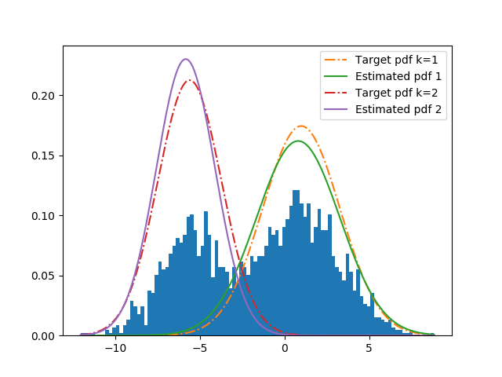

# pytorch-stats

Work in progress toolbox to estimate parameters of distributions in 
PyTorch to utilize GPU parallelization and automatic differentiation.
 
### Content
Incorporated algorithms:
- (MLE) Maximum Likelihood Estimation using gradient descent optimization
- (MAP) Maximum a Posteriori Estimation using gradient descent optimization
- (MM-MLE) Mixture Model Maximum Likelihood Estimation using gradient descent optimization

### Examples
#### MAP vs MLE
Given observations from a bimodal normal distribution with unknown parameters,
of which we want to estimate a target distribution (green in the figure),
utilizing a prior can greatly improve the estimator as seen in the figure.
The code for this plot can be found in the [MAP implementation](stats/estimation/map.py)
and can be run via `python -m stats.estimation.map`.

#### Mixture Model MLE
The code for this plot can be found in the [MM implementation](stats/estimation/mm.py)
and can be run via `python -m stats.estimation.mm`.

