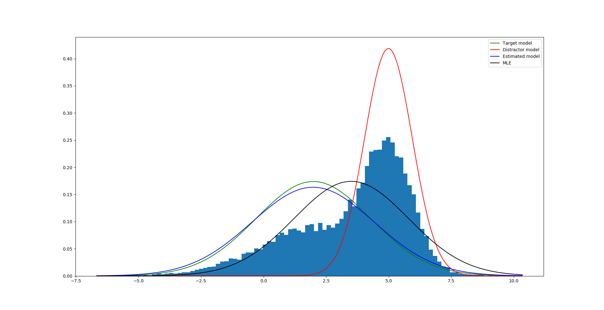

# pytorch-stats

Work in progress toolbox to estimate parameters of distributions in 
PyTorch to utilize GPU parallelization and automatic differentiation.
 
### Content
Incorporated algorithms:
- (MLE) Maximum Likelihood Estimation using gradient descent optimization
- (MAP) Maximum a Posteriori Estimation using gradient descent optimization

### Examples
Given a bimodal normal distribution of unkown parameters, 
utilizing a prior can greatly improve the estimator as seen below.
